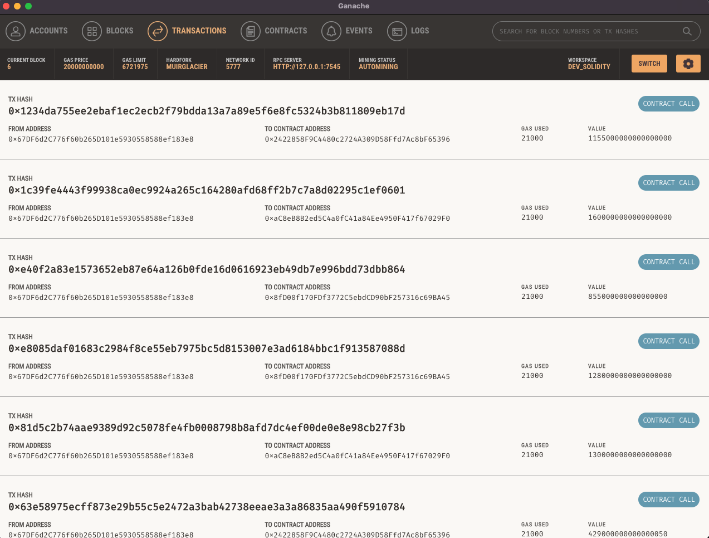
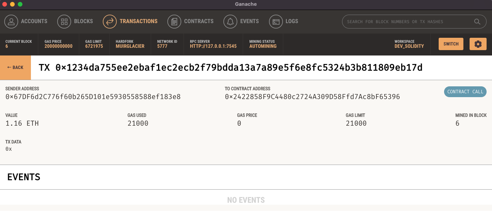

# FinTech Finder
## Ethereum Blockchain Network Cryptocurrency Payment System

## Technologies

This cryptocurrecy payment transfer system was built with the following technologies:

### Language

| Language | Version |
|----------|---------|
| Python   | 3.7.11  |

### Libraries and Frameworks

| Component | Version |
|-----------|---------|
| Anaconda  | 1.9.0   |
| Conda     | 4.11.0  |
| Streamlit | 1.9.0   |

### Operating System

This version of the software is operating system agnostic.

---
## Installation Guide

### Pre-requisites

- Python 3.7
- Anaconda 1.9.0
- Conda 4.11.0
- A conda environment created specially for this project.

### Running the Ledger

1. Install a new conda environment for this project. We will be using `python 3.7.11` for this repository.

```bash
conda create -n dev_pychain python=3.7.11 anaconda
```

2. Activate the newly created environment and verify the python version.

```bash
conda activate dev_pychain
python --version
```

3. Install the required python packages.

```bash
pip install streamlit
pip install bip44

conda install -c anaconda ipykernel
python -m ipykernel install --user --name=dev_pychain
conda install -c conda-forge web3
conda install -c conda-forge python-dotenv

```

4. Run the streamlit app

```bash
streamlit run fintech_finder.py
```

---
## Demo Video

---

## Demo Screenshots

#### Streamlit Homepage


---
#### Transaction with Validated Hash


---
#### Transaction in Ganache


---
#### Transaction Details from Ganache


---
